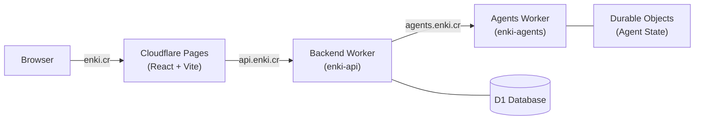

# [enki.cr](https://enki.cr)

## Architecture



- **Frontend**: React + Vite on Cloudflare Pages (`enki.cr`)
- **Backend**: Cloudflare Worker (`enki-api`) at `api.enki.cr` — API gateway with auth, key management, and outline processing
- **Agents**: Cloudflare Worker (`enki-agents`) at `agents.enki.cr` — three Agent classes on the Cloudflare Agents SDK (Durable Objects)
- **Database**: Cloudflare D1 (`enki-db`) — API keys and settings

Architectural decisions are recorded in [`doc/adr/`](doc/adr/). See [ADR-0001](doc/adr/0001-record-architecture-decisions.md) for the format.

## Infrastructure as Code

All Cloudflare resources are managed with Terraform in the [`infra/`](infra/) directory.

### Change Flow

1. Create a branch
2. Edit files in `infra/`
3. Open a PR — GitHub Actions runs `terraform plan` and posts the output as a comment
4. Review the plan
5. Merge to `main` — GitHub Actions runs `terraform apply`

### Terraform vs Wrangler

| Concern | Managed by |
|---------|-----------|
| Pages project, Worker scripts, custom domains, D1 database | Terraform |
| DNS records | Auto-managed by Pages/Workers custom domains |
| Code deployment, content uploads | Wrangler |
| Agent bindings, migrations | Wrangler (`agents/wrangler.jsonc`) |
| Local development | Wrangler (`wrangler dev`) / Vite (`vite`) |

These tools never manage the same resource attributes. Worker scripts use `lifecycle { ignore_changes = [content] }` in Terraform so Wrangler owns the deployed code.

### Adding New Resources

Add a `.tf` file (or edit an existing one) in `infra/`, then follow the change flow above.

### Secrets Management

- **Terraform variables**: Passed via `TF_VAR_*` environment variables, stored as GitHub repository secrets
- **Runtime secrets**: Set via `wrangler secret put <NAME>` per Worker

### Local Development

```bash
# Frontend (Vite dev server with API proxy)
cd frontend && npm run dev

# Backend
cd backend && npm run dev

# Agents
cd agents && npm run dev
```

## CI/CD

| Workflow | Trigger | Purpose |
|----------|---------|---------|
| `ci-frontend.yml` | PR (frontend changes) | Lint, type-check, test |
| `ci-backend.yml` | PR (backend changes) | Type-check, unit/integration tests |
| `ci-agents.yml` | PR (agents changes) | Type-check |
| `deploy-frontend.yml` | Push to main (frontend changes) | Deploy to Cloudflare Pages |
| `deploy-backend.yml` | Push to main (backend changes) | Deploy, then E2E tests |
| `deploy-agents.yml` | Push to main (agents changes) | Deploy to Cloudflare Workers |
| `terraform-plan.yml` | PR (infra changes) | Plan and comment on PR |
| `terraform-apply.yml` | Push to main (infra changes) | Apply Terraform changes |

## Bootstrap (One-Time Setup)

Before the first `terraform init`, create the R2 state bucket and S3 API credentials:

```bash
npx wrangler r2 bucket create enki-terraform-state
```

Then create an R2 S3 API token in the Cloudflare dashboard (R2 > Manage R2 API Tokens) with read/write access to the `enki-terraform-state` bucket. Set `AWS_ACCESS_KEY_ID` and `AWS_SECRET_ACCESS_KEY` as environment variables and GitHub secrets.

Initialize Terraform and import the existing Pages project:

```bash
cd infra
terraform init -backend-config="endpoints={s3=\"https://<ACCOUNT_ID>.r2.cloudflarestorage.com\"}"
terraform import cloudflare_pages_project.frontend <ACCOUNT_ID>/enki
terraform plan  # Should show minimal changes
```
