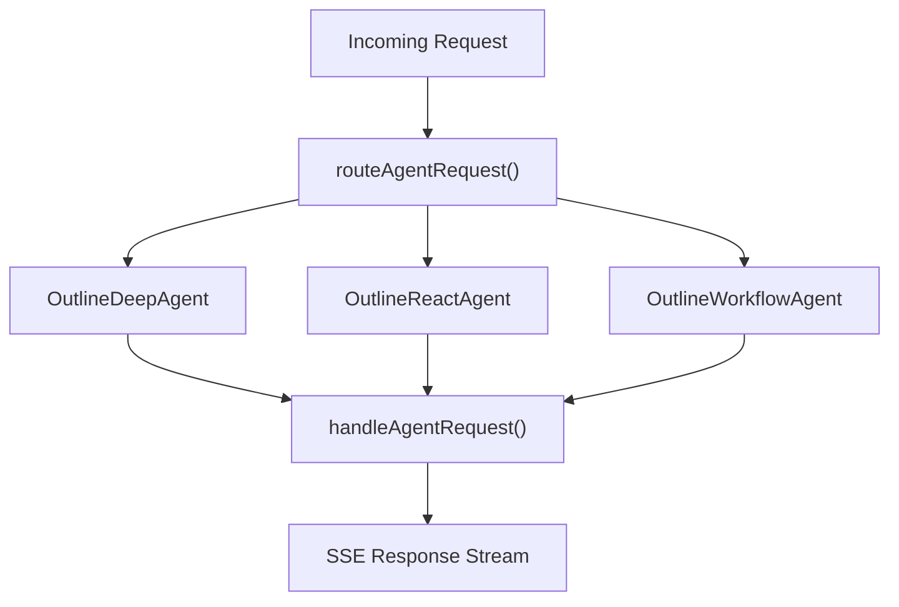

# enki-agents

Three Agent classes on the Cloudflare Agents SDK, deployed as a single Worker with Durable Objects.

## Architecture



Each agent class extends `Agent<Env, State>` and is backed by a Durable Object with SQLite storage. Routing is handled by `routeAgentRequest()` for deterministic, session-based dispatch.

**Current state**: Agents return mock SSE responses that echo back received sources. LangGraph integration for real AI orchestration is planned (see [ADR-0003](../doc/adr/0003-agents-sdk-for-agents.md)).

## Agent Classes

| Class | Binding | Purpose |
|-------|---------|---------|
| `OutlineDeepAgent` | `OUTLINE_DEEP_AGENT` | Deep analysis/generation |
| `OutlineReactAgent` | `OUTLINE_REACT_AGENT` | ReAct-style reasoning |
| `OutlineWorkflowAgent` | `OUTLINE_WORKFLOW_AGENT` | Multi-step workflow orchestration |

## Prerequisites

- Node.js 22
- Wrangler CLI (`npm i -g wrangler`)

## Setup

```bash
npm install
```

## Development

```bash
npm run dev
```

Starts a local Wrangler dev server with Durable Object bindings.

## Configuration

- `wrangler.jsonc` — Agent bindings, DO migrations, compatibility settings

## Project Structure

```
agents/
  src/
    index.ts              # Agent classes, request routing, SSE response stream
  wrangler.jsonc          # Worker + Durable Object configuration
```

## Adding a New Agent

1. Create a new class extending `Agent<Env, State>` in `src/index.ts`
2. Add a DO binding in `wrangler.jsonc` under `durable_objects.bindings`
3. Add the class name to the next migration tag in `wrangler.jsonc` under `migrations`

## SSE Event Protocol

Agents emit SSE events following the OpenAI Responses API format:

| Event | Description |
|-------|-------------|
| `response.created` | Stream initialized |
| `response.output_item.added` | New message item started |
| `response.content_part.added` | Content part started |
| `response.output_text.delta` | Text chunk |
| `response.output_text.done` | Text complete |
| `response.content_part.done` | Content part complete |
| `response.output_item.done` | Message item complete |
| `response.completed` | Stream finished |
