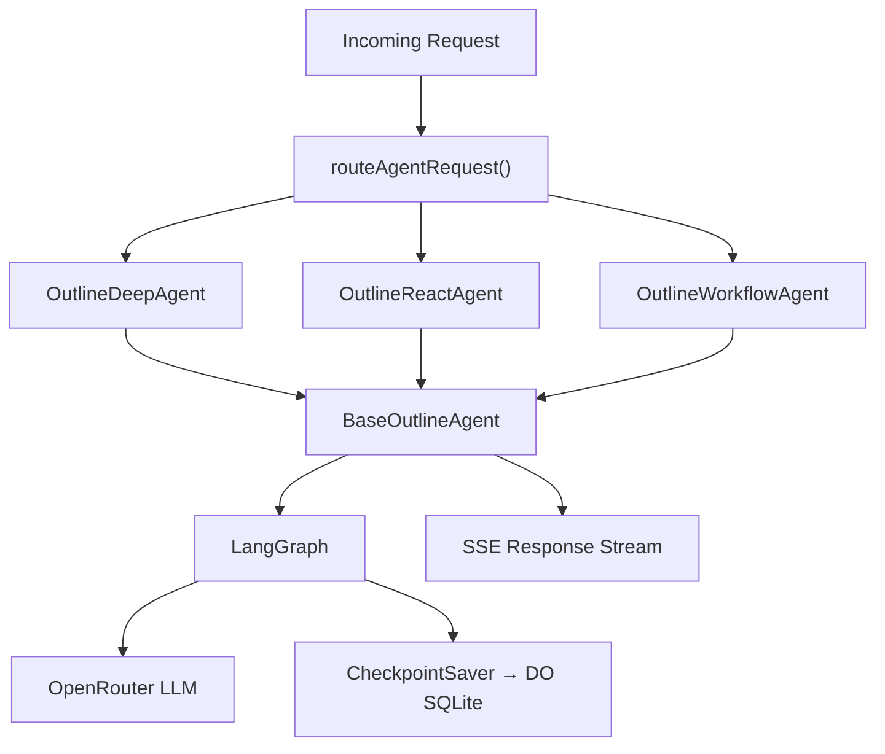

# enki-agents

Three Agent classes on the Cloudflare Agents SDK with LangGraph AI orchestration, deployed as a single Worker with Durable Objects.

## Architecture



Each agent class extends `BaseOutlineAgent` which handles routing, input validation, logging, and SSE streaming. Graph execution is delegated to LangGraph with checkpoint persistence in DO-backed SQLite.

**Fallback**: When `OPENROUTER_API_KEY` is not configured, agents return mock SSE responses.

## Agent Classes

| Class | Binding | Graph Topology |
|-------|---------|----------------|
| `OutlineDeepAgent` | `OUTLINE_DEEP_AGENT` | Linear: research → analyze → synthesize → format |
| `OutlineReactAgent` | `OUTLINE_REACT_AGENT` | ReAct loop: reason ↔ (loop or format) |
| `OutlineWorkflowAgent` | `OUTLINE_WORKFLOW_AGENT` | Multi-step: plan → research → aggregate → critique → revise → format |

## Prerequisites

- Node.js 22
- Wrangler CLI (`npm i -g wrangler`)

## Setup

```bash
npm install
```

## Development

```bash
npm run dev
```

Starts a local Wrangler dev server with Durable Object bindings.

## Testing

```bash
npm run test:unit          # Unit tests
npm run test:integration   # Integration tests (requires Wrangler)
npm run test               # All tests
```

## Configuration

- `wrangler.jsonc` — Agent bindings, DO migrations, compatibility settings
- `OPENROUTER_API_KEY` — Secret for OpenRouter LLM access

## Project Structure

```
agents/
  src/
    index.ts              # Re-exports + default fetch
    types.ts              # Shared types
    agents/               # Agent classes (base + 3 concrete)
    sse/                  # SSE event builders + stream adapter
    llm/                  # OpenRouter client + checkpoint saver
    graphs/               # LangGraph graph definitions
    infrastructure/       # Logger, request handler, health
  tests/
    unit/                 # Unit tests (vitest)
    integration/          # Integration tests (workers pool)
  wrangler.jsonc          # Worker + Durable Object configuration
```

## Adding a New Agent

1. Define the graph in `src/graphs/outline-{name}.ts`
2. Create agent class in `src/agents/outline-{name}-agent.ts` extending `BaseOutlineAgent`
3. Export from `src/index.ts`
4. Add DO binding and migration entry in `wrangler.jsonc`

## SSE Event Protocol

Agents emit SSE events following the OpenAI Responses API format:

| Event | Description |
|-------|-------------|
| `response.created` | Stream initialized |
| `response.output_item.added` | New message item started |
| `response.content_part.added` | Content part started |
| `response.output_text.delta` | Text chunk |
| `response.output_text.done` | Text complete |
| `response.content_part.done` | Content part complete |
| `response.output_item.done` | Message item complete |
| `response.completed` | Stream finished |
| `error` | Error during processing |
