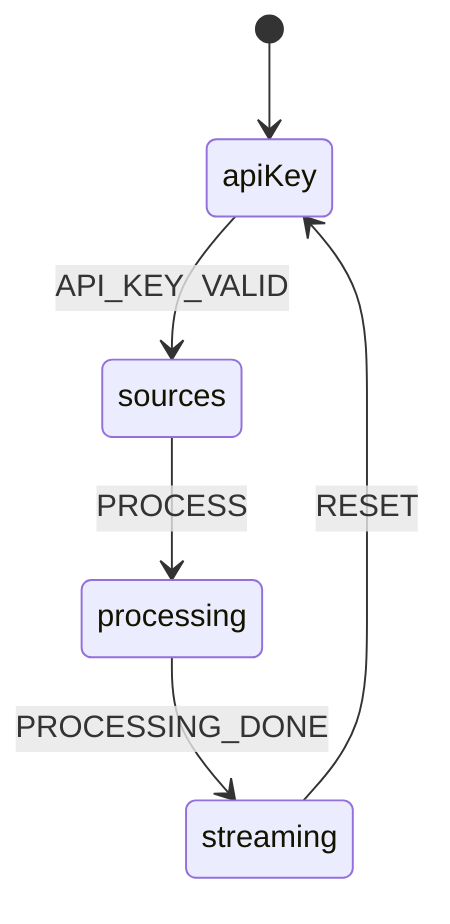

# enki-frontend

React 19 + Vite interactive consulting modal on Cloudflare Pages.

## Architecture



The frontend is a single-page app that presents a modal wizard for outline generation. The `useModalState` reducer drives transitions between four states: API key entry, source input, processing (backend call), and streaming (SSE result display).

## Prerequisites

- Node.js 22

## Setup

```bash
npm install
```

## Development

```bash
npm run dev
```

Starts the Vite dev server with HMR. The dev server proxies `/api` requests to the backend Worker.

## Build

```bash
npm run build
```

Outputs to `dist/` for deployment to Cloudflare Pages.

## Testing

```bash
npm test              # all unit/integration tests (vitest)
npm run test:unit     # unit tests only
npm run test:integration  # integration tests only
npm run test:e2e      # E2E tests (Playwright)
```

## Project Structure

```
frontend/
  src/
    main.tsx                  # App entrypoint
    App.tsx                   # Root component
    api/
      adapter.ts              # ChatModelAdapter — SSE streaming to assistant-ui
    components/
      EnkiModal.tsx           # Modal container, state-driven view switching
      ApiKeyForm.tsx          # API key input and validation
      SourcesForm.tsx         # Source URL input form
      ProcessingThrobber.tsx  # Loading indicator during processing
      EventStream.tsx         # SSE event stream display
    hooks/
      useModalState.ts        # Reducer for modal state machine
    runtime/
      setup.ts                # assistant-ui runtime setup
    styles/
      global.css              # Global styles
      modal.css               # Modal-specific styles
    utils/
      validation.ts           # Input validation helpers
  tests/
    unit/                     # Unit tests (vitest)
    integration/              # Integration tests (vitest)
    e2e/                      # E2E tests (Playwright)
  vitest.config.ts            # Vitest configuration
  playwright.config.ts        # Playwright configuration
```

## Key Patterns

- **State machine**: `useModalState` reducer manages the modal flow (apiKey → sources → processing → streaming)
- **SSE streaming**: `ChatModelAdapter` in `adapter.ts` connects to the backend SSE endpoint and feeds events to the `assistant-ui` runtime
- **assistant-ui**: Uses `@assistant-ui/react` for the chat/streaming UI runtime
