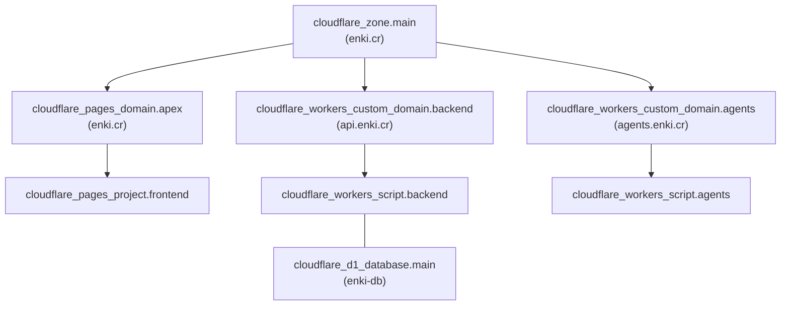

# infra

Terraform IaC for all Cloudflare resources powering Enki.

## Architecture

## State Backend

Terraform state is stored in an R2 bucket (`enki-terraform-state`) using the S3-compatible backend. See the root [README](../README.md#bootstrap-one-time-setup) for bootstrap instructions.

## Variables

| Variable | Description | Default |
|----------|-------------|---------|
| `account_id` | Cloudflare account ID | — |
| `domain` | Primary domain | `enki.cr` |
| `openrouter_api_key` | OpenRouter API key for agent LLM calls | — (sensitive) |

Variables are passed via `TF_VAR_*` environment variables, stored as GitHub repository secrets.

## Resources

| Resource | Type | Purpose |
|----------|------|---------|
| `cloudflare_zone.main` | Data source | DNS zone lookup for enki.cr |
| `cloudflare_pages_project.frontend` | Pages project | Frontend hosting |
| `cloudflare_pages_domain.apex` | Pages domain | Custom domain (enki.cr) |
| `cloudflare_workers_script.backend` | Worker script | Backend API (enki-api) |
| `cloudflare_workers_script.agents` | Worker script | Agents (enki-agents) |
| `cloudflare_workers_custom_domain.backend` | Custom domain | api.enki.cr |
| `cloudflare_workers_custom_domain.agents` | Custom domain | agents.enki.cr |
| `cloudflare_d1_database.main` | D1 database | enki-db |

Worker scripts use `lifecycle { ignore_changes = [...] }` so Terraform provisions the resource while Wrangler owns the deployed code and bindings.

## Change Flow

1. Create a branch
2. Edit files in `infra/`
3. Open a PR — `terraform-plan.yml` runs `terraform plan` and posts the output as a PR comment
4. Review the plan
5. Merge to `main` — `terraform-apply.yml` runs `terraform apply`

## Files

| File | Purpose |
|------|---------|
| `terraform.tf` | Backend config, required providers |
| `providers.tf` | Cloudflare provider |
| `variables.tf` | Input variables |
| `locals.tf` | Local values |
| `frontend.tf` | Pages project and custom domain |
| `backend.tf` | Backend Worker, custom domain, D1 database |
| `agents.tf` | Agents Worker and custom domain |
| `dns.tf` | Zone data source (DNS auto-managed by custom domains) |
| `outputs.tf` | Exported values |
